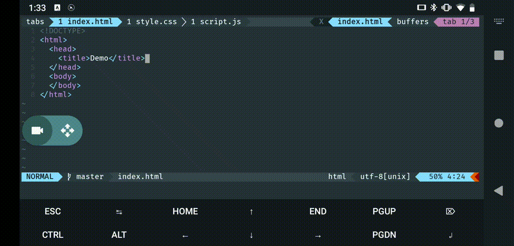

<div>
  
</div>

# TermDE

Provides minimal configurations for [Termux](https://termux.com) to function as a development environment.



## Features

- Using [Neovim](https://github.com/neovim/neovim) as source code editor.
- IntelliSense code-completion using [coc.nvim](https://github.com/neoclide/coc.nvim).
- Shows Git status and diffs in realtime using [coc-git](https://github.com/neoclide/coc-git).
- Preview Markdown files with [markdown-preview.nvim](https://github.com/iamcco/markdown-preview.nvim).
- Supports common editor keyboard shortcuts.

> **Note:** IntelliSense requires additional extensions/plugins and manual configurations.
> For HTML, CSS, and Typescript/Javascript as shown in the demo, simply install
> [coc-html](https://github.com/neoclide/coc-html), [coc-css](https://github.com/neoclide/coc-css), and [coc-tsserver](https://github.com/neoclide/coc-tsserver):
>
> ```
> :CocInstall coc-html coc-css coc-tsserver
> ```

## Requirements

The only requirment is [Termux:API](https://wiki.termux.com/wiki/Termux:API) to access the system clipboard.

## Installation

Run the following command to install the latest release:

```bash
curl -sL "https://api.github.com/repos/meiuwa/termde/releases/latest" \
  | awk '/browser_download_url/ {print $2}' \
  | xargs curl -LC - -o $TMPDIR/termde-latest.deb \
  && pkg install -y $TMPDIR/termde-latest.deb
```
> **Note:** Existing configurations may be overwritten when installing for the first time.

## Shortcuts

Conquer of Completion key mappings for highlighted symbol:

<ul>
  <li><kbd>Alt</kbd>+<kbd>1</kbd> Show documentation in preview window</li>
  <li><kbd>Alt</kbd>+<kbd>2</kbd> Rename symbol</li>
  <li><kbd>Alt</kbd>+<kbd>3</kbd> Go to definition</li>
  <li><kbd>Alt</kbd>+<kbd>4</kbd> Go to type definition</li>
  <li><kbd>Alt</kbd>+<kbd>5</kbd> Go to references</li>
  <li><kbd>Alt</kbd>+<kbd>6</kbd> Go to implementation</li>
</ul>

Common editor key mappings:

<ul>
  <li><kbd>Ctrl</kbd>+<kbd>Alt</kbd>+<kbd>Q</kbd> Force quit all buffer</li>
  <li><kbd>Ctrl</kbd>+<kbd>Q</kbd> Quit current buffer</li>
  <li><kbd>Ctrl</kbd>+<kbd>W</kbd> Save and quit current buffer</li>
  <li><kbd>Ctrl</kbd>+<kbd>S</kbd> Save</li>
  <li><kbd>Ctrl</kbd>+<kbd>A</kbd> Select all</li>
  <li><kbd>Ctrl</kbd>+<kbd>C</kbd> Copy</li>
  <li><kbd>Ctrl</kbd>+<kbd>X</kbd> Cut</li>
  <li><kbd>Ctrl</kbd>+<kbd>V</kbd> Paste</li>
  <li><kbd>Ctrl</kbd>+<kbd>Z</kbd> Undo</li>
  <li><kbd>Ctrl</kbd>+<kbd>Y</kbd> Redo</li>
</ul>

Miscellaneous keyboard mappings:

<ul>
  <li><kbd>Ctrl</kbd>+<kbd>P</kbd> Preview Markdown on a browser</li>
  <li><kbd>Ctrl</kbd>+<kbd>←</kbd> Switch to previous tab</li>
  <li><kbd>Ctrl</kbd>+<kbd>→</kbd> Switch to next tab</li>
</ul>

## Extras

To build the package from source, use [termux-create-package](https://github.com/termux/termux-create-package):

```bash
pkg install -y termux-create-package
termux-create-package --prefix $HOME/ manifest.json
```
